# PicKey

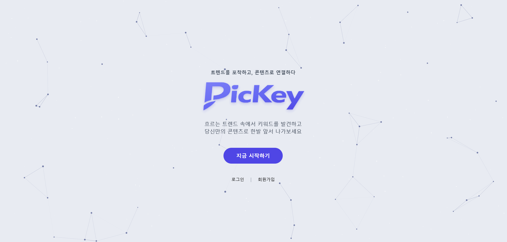

> 마케터와 크리에이터를 위한 KeyBERT 기반 트렌드 키워드 분석 및 맥락 요약 서비스

**과제명:** 데이터 분석 기반 트렌드 키워드 센싱 

**팀명:** 프리즘(Prism)

**프로젝트 기간:** 2026.02.19 ~ 2026.03.26

**팀원 및 역할**  
- 박은서(팀장) - AI Modeling, Back-end
- 윤동현 - Back-end
- 임기준 - AI Modeling
- 이홍진 - Front-end
- 최정욱 - Front-end


<br>

---

## 서비스 소개

**PicKey**는 유튜브, 커뮤니티, 뉴스 데이터를 수집·분석하여  
급상승 트렌드 키워드를 탐지하고, 키워드의 **맥락·여론·연관 반응·콘텐츠 활용 포인트**까지 함께 제공하는 서비스입니다.

단순히 많이 언급된 키워드를 보여주는 데 그치지 않고,  
**KeyBERT 기반 키워드 추출**, **감성 분석**, **RAG 기반 LLM 요약**, **콘텐츠 생성 프롬프트 지원**을 결합하여  
마케터와 크리에이터가 더 빠르고 정확하며 안전하게 트렌드를 해석하고 활용할 수 있도록 돕습니다.

<br>

### 기획 배경

- 디지털 마케팅 환경에서 소셜/커뮤니티 데이터의 전략적 가치가 커지고 있음
- 기존 트렌드 분석은 정형 데이터 중심이거나 수작업 의존도가 높아, 맥락 파악과 실무 활용에 한계가 있음
- 마케터와 크리에이터는 단순 키워드 나열이 아니라, **왜 뜨는지 / 반응이 어떤지 / 어떻게 활용할지**까지 한 번에 확인할 수 있는 도구가 필요함

<br>

---

## 주요 기능

### 1. 실시간 트렌드 키워드 탐지
유튜브와 주요 커뮤니티 데이터를 기반으로 급상승 키워드를 탐지하고,  
오늘의 트렌드 키워드 및 플랫폼별 키워드를 대시보드에서 제공합니다.

### 2. 트렌드 대시보드
오늘의 트렌드 키워드 Top 20, 플랫폼별 반응, 관련 뉴스, 관련 유튜브 반응,  
커뮤니티 인기글 등을 한눈에 확인할 수 있습니다.

### 3. 키워드 심층 분석
선택한 키워드에 대해 다음 정보를 제공합니다.

- 트렌드 스코어
- 언급량 추이
- 여론 분석
- 실제 반응(게시글/댓글) 예시
- AI 기반 트렌드 인사이트
- 관련 뉴스 / 관련 유튜브 / 연관 정보 링크

### 4. 부정 반응 및 리스크 확인
인물 키워드와 일반 키워드를 구분하여 부정 반응을 관리하고,  
잠재적 논란 요소를 사전에 확인할 수 있도록 설계했습니다.

### 5. 콘텐츠 생성 프롬프트 지원
사용자가 **주제 키워드, 콘텐츠 유형, 업종, 목적, 타겟, 기타 요구사항**을 입력하면  
분석 결과를 바탕으로 마케팅 콘텐츠 초안용 프롬프트를 생성할 수 있습니다.

### 6. 마이페이지 / 스크랩
관심 키워드 스크랩, 저장된 생성 결과물 관리, 계정 정보 수정,  
선호 플랫폼/뉴스 카테고리 설정 등을 지원합니다.

### 7. 회원가입 / 로그인
이메일 기반 회원가입 및 로그인, 비밀번호 검증, 인증번호 확인,  
카카오/네이버 소셜 로그인 흐름을 포함합니다.

<br>

---

## 메뉴 구성

- **메인화면**
- **트렌드 대시보드**
- **키워드 심층 분석**
- **콘텐츠 생성**
- **마이페이지**

<br>

---

## 데이터 수집 및 분석 파이프라인

### 데이터 수집

#### 1) 유튜브 데이터
- YouTube Data API를 활용해 영상 제목, 해시태그, 댓글 데이터 수집
- 매일 6개 카테고리에서 최대 40개 영상씩, 약 240개 영상 텍스트 데이터 수집

#### 2) 커뮤니티 데이터
- Python의 Playwright, BeautifulSoup를 활용한 게시글/댓글 스크래핑
- 매일 5개 커뮤니티에서 각 150여 개 게시글, 총 약 750여 개 게시글 텍스트 수집

#### 3) 뉴스 데이터
- 구글 뉴스 RSS 및 네이버 뉴스 API를 활용해 최신 뉴스 데이터 수집

<br>

### 분석 방식

#### 1) 트렌드 키워드 추출
- KeyBERT를 활용해 문서 단위 핵심 키워드 후보 추출
- 전일 대비 언급량 변화, 플랫폼 편중 보정, 제목 등장 횟수 등을 반영해  
  **트렌드 점수(0~100)** 산출
- 품질 필터링을 통해 신규성과 확산성을 동시에 갖춘 키워드만 선별

#### 2) 인물 키워드 판별
- KoELECTRA 기반 NER로 1차 판별
- 인물로 인식된 키워드는 LLM(GPT-4o-mini)으로 실존 인물 여부를 추가 판별

#### 3) 감성 분석
- KcELECTRA를 기반으로 긍정 / 중립 / 부정 반응 분석
- 키워드별 여론 흐름을 시각화하여 제공

#### 4) 맥락 요약 및 활용 지원
- RAG 기반 LLM으로 키워드의 배경, 반응, 주의점, 콘텐츠 활용 포인트를 요약
- 분석 결과를 기반으로 콘텐츠 제작용 프롬프트 생성 지원

<br>

---

## 폴더구조
```plaintext
project-root/
├── frontend/                    # 사용자 웹 애플리케이션
│   ├── public/                  # 정적 파일
│   ├── src/                     # 화면, 컴포넌트, 상태관리, API 연동
│   ├── package.json
│   ├── vite.config.js
│   ├── tailwind.config.js
│   └── postcss.config.js
│
├── backend/                     # API 서버 및 데이터 처리 로직
│   ├── data/                    # 백엔드 내부 데이터/샘플 데이터
│   ├── package.json
│   └── .env
│
├── koelectra/                   # 감성 분석 및 AI 모델 모듈
│   ├── koelectra_model/         # 모델 파일/설정
│   └── batch_sentiment_analyzer.py
│
├── requirements.txt             # Python 의존성
├── README.md
├── .gitignore
└── LICENSE
```

<br>

---

## 시스템 아키텍처

### 서비스 구성 개요

- **Frontend**
  - React
  - JavaScript
  - Tailwind CSS
  - Axios

- **Backend**
  - Node.js
  - Express

- **AI / Data Pipeline**
  - Python
  - KeyBERT
  - KoELECTRA
  - KcELECTRA
  - LLM
  - RAG

- **Database**
  - MySQL

- **Infra**
  - AWS
  - S3 정적 웹 호스팅
  - Private Subnet EC2
  - Docker
  - ALB(Application Load Balancer)

<br>

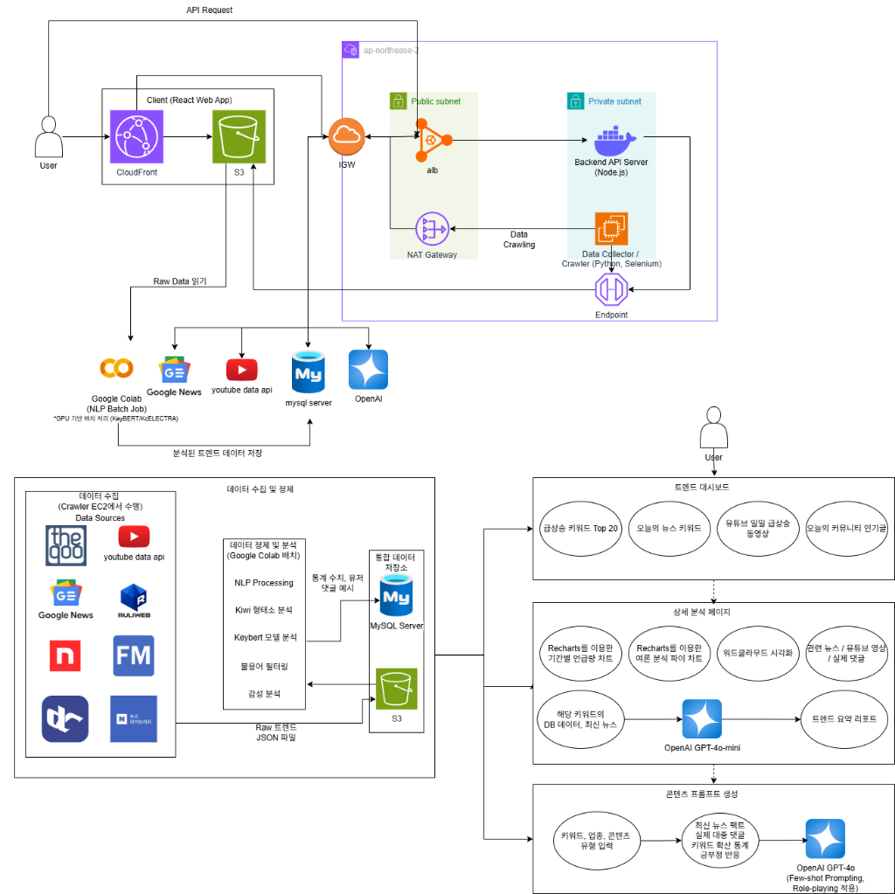

---

## 기술 스택

### Frontend


### Backend


### AI / NLP


### Database / Infra


<br>

---

## 유스케이스 다이어그램
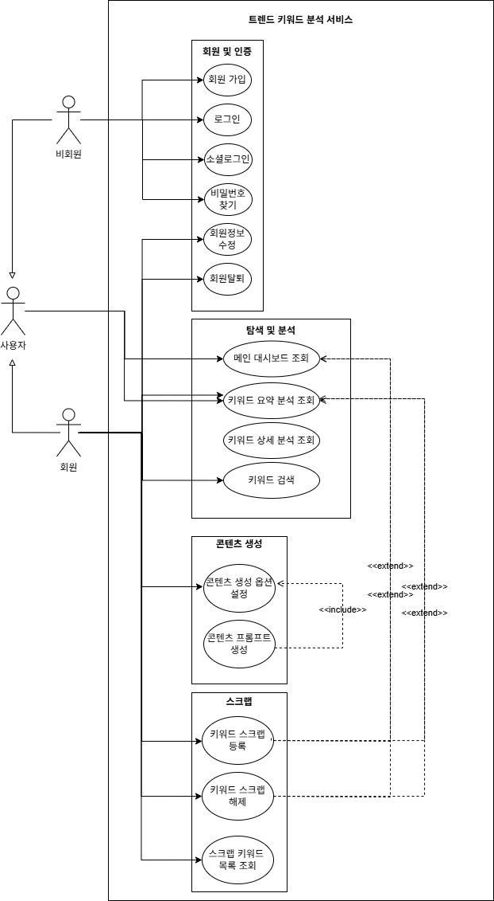

---

## 서비스 플로우
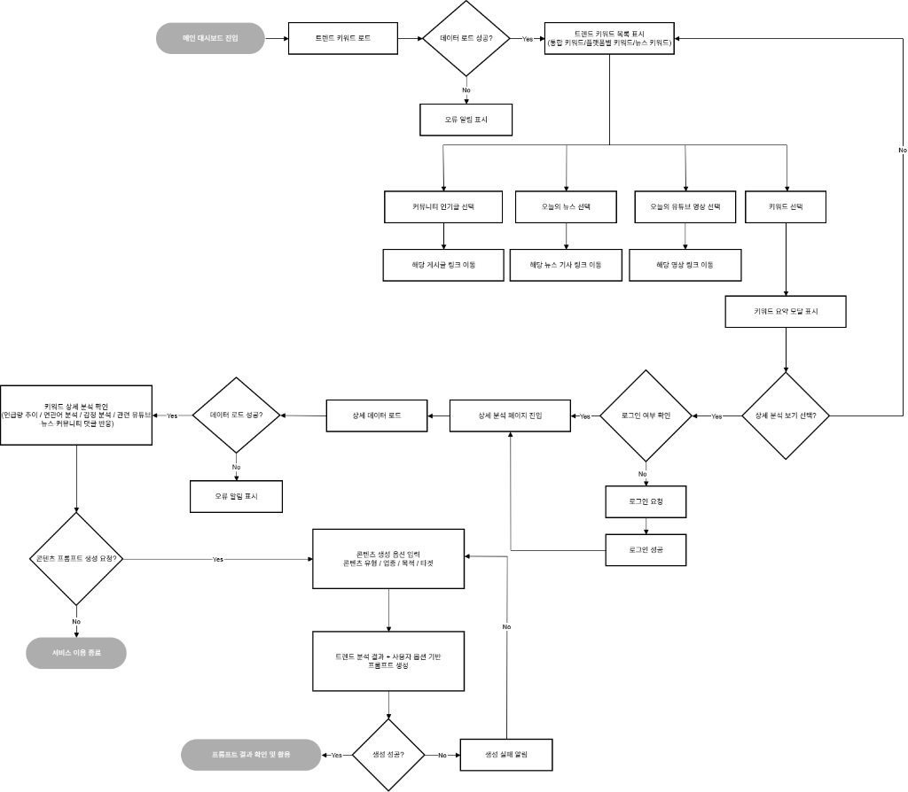

---

## 화면 구성

### 1. 메인화면
- 서비스 아이덴티티와 소개 문구 제공
- 오늘의 트렌드 키워드 확인
- 플랫폼별 키워드 / 관련 뉴스 / 유튜브 반응 / 커뮤니티 인기글 제공
- 검색창을 통한 키워드 직접 탐색 지원

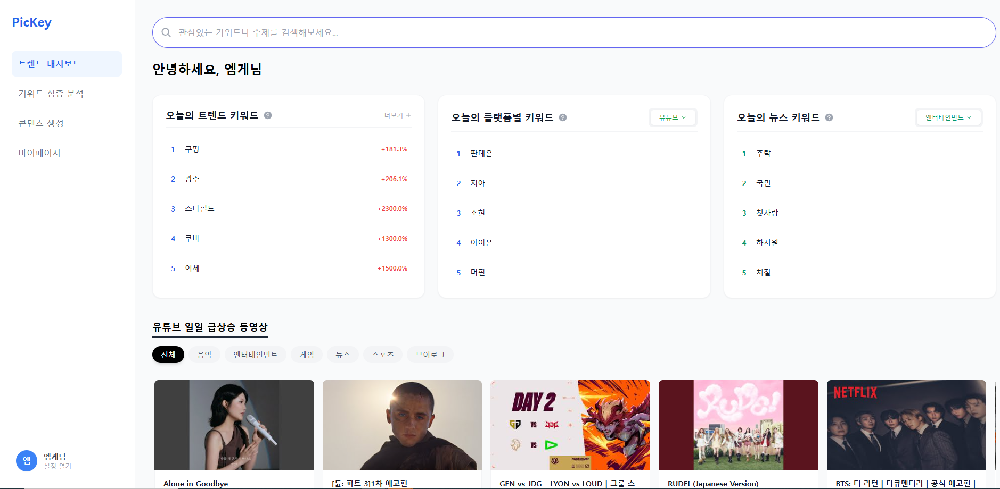

### 2. 트렌드 대시보드
- 오늘의 트렌드 키워드 Top 20 제공
- 키워드 요약 분석 모달 제공
- 언급량 추이, 여론 분석, 실제 반응 예시 확인
- 콘텐츠 생성 및 상세 리포트 이동 가능

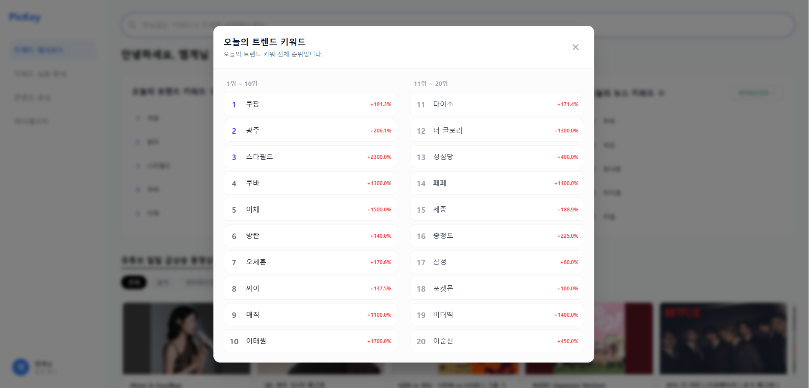

### 3. 키워드 심층 분석
- 키워드 검색 및 스크랩
- 분석 기간 / 플랫폼 필터 설정
- 트렌드 스코어 및 관심도 추이 시각화
- 연관 정보 확인 및 콘텐츠 생성 페이지 이동

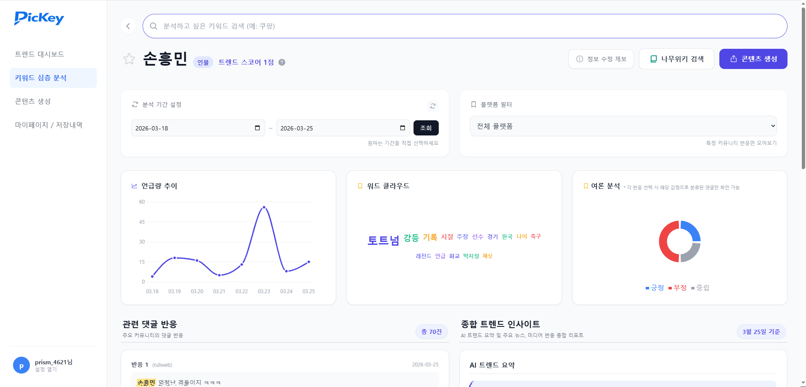

### 4. 콘텐츠 생성
- 주제 키워드, 콘텐츠 유형, 업종, 목적, 타겟, 기타 요구사항 입력
- 생성된 프롬프트 저장 및 복사 지원

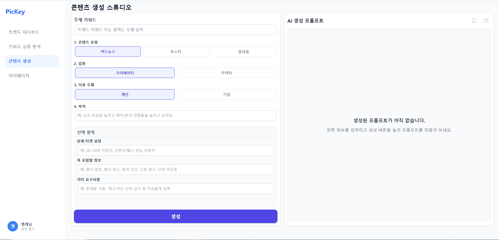

### 5. 마이페이지
- 프로필/계정 정보 관리
- 선호 플랫폼 및 뉴스 카테고리 설정
- 스크랩한 키워드 조회 및 관리
- 저장된 생성 결과물 조회

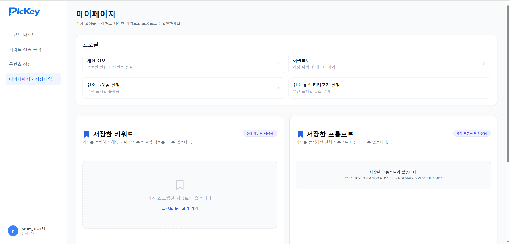

### 6. 회원가입 / 로그인
- 이메일 기반 회원가입 및 로그인
- 입력값 유효성 검증
- 비밀번호 찾기
- 카카오 / 네이버 소셜 로그인 지원

#### <회원가입>
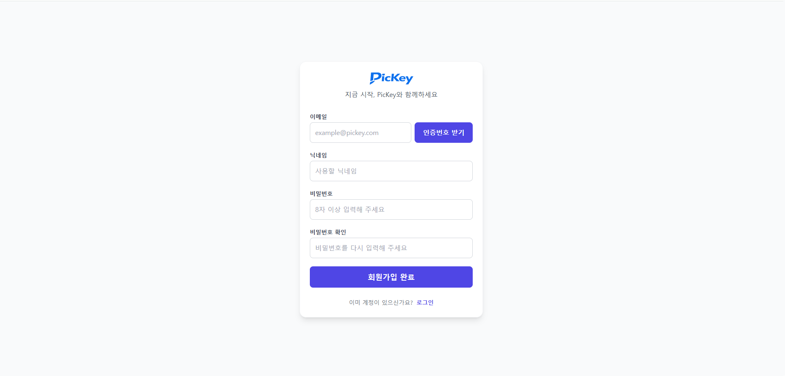

#### <로그인>
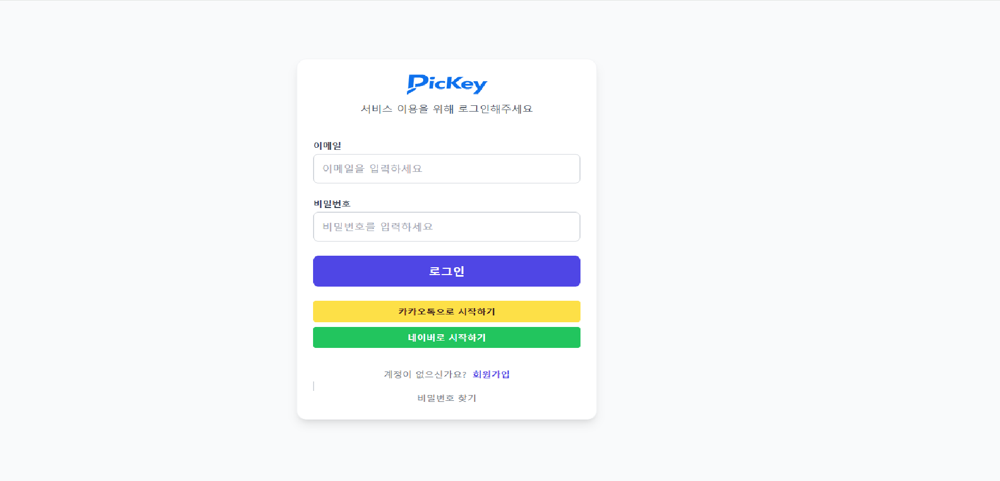

<br>

---

## 핵심 데이터 구조

본 서비스는 다음과 같은 핵심 데이터를 중심으로 구성됩니다.

### 1. 회원
- 회원 이메일
- 비밀번호
- 닉네임
- 선호 커뮤니티 / 선호 뉴스 카테고리
- 소셜 로그인 정보

### 2. 트렌드 키워드
- 키워드 ID
- 키워드명
- 인물 키워드 여부

### 3. 키워드 통계 정보
- 키워드 요약 정보
- 기준 날짜
- 언급량
- 긍정 / 부정 / 중립 점수
- 트렌드 점수
- 플랫폼별 점수 및 언급량

### 4. 키워드 사용 예시
- 실제 게시글 / 댓글 내용
- 링크
- 감정 라벨
- 수집 날짜

### 5. 스크랩 키워드
- 회원별 관심 키워드 스크랩 정보
- 스크랩 날짜

### 6. 마케팅 산출물
- 생성 형식
- 생성된 내용
- 생성 날짜
- 생성 회원 및 기준 키워드 정보

<br>

## ER 다이어그램
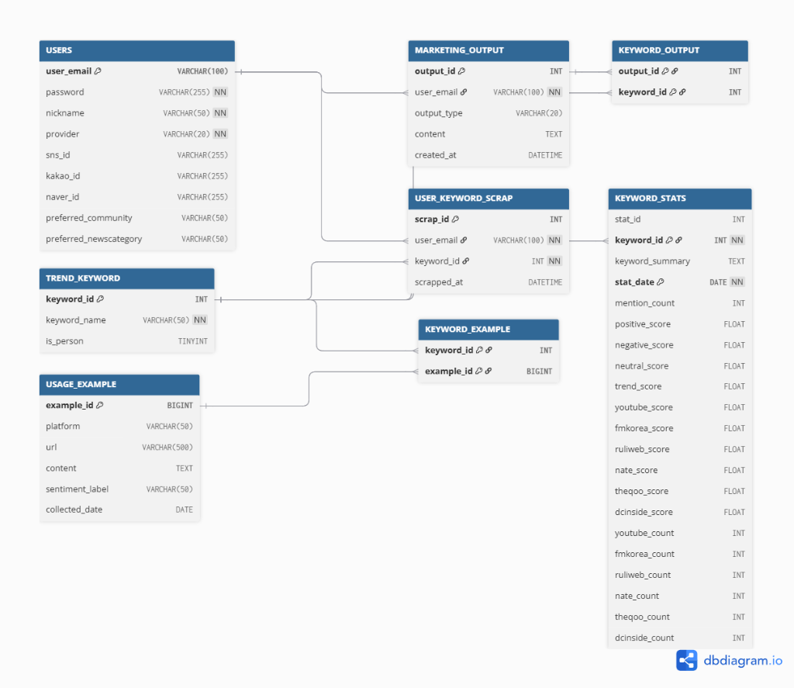

---

## 기대 효과

- 트렌드 키워드의 **맥락까지 함께 제공**하여 조사 시간과 해석 부담을 줄일 수 있음
- 감성 분석과 부정 반응 확인을 통해 **잠재적 리스크를 사전에 파악**할 수 있음
- 분석 결과를 프롬프트 생성과 연결하여 **실제 콘텐츠 기획 단계까지 바로 활용**할 수 있음
- 브랜드 마케팅, SNS 콘텐츠 기획, 트렌드 리서치, 홍보 전략 수립 등 다양한 실무에 활용 가능

<br>

---

## 트러블슈팅

- **문제 1**  
  날짜 필터 변경 시 `startDate`, `endDate`만으로 상태를 관리해 달력에서 날짜를 클릭할 때마다 즉시 조회가 실행되는 문제가 발생 
  
  → `inputStartDate`, `inputEndDate`와 `appliedStartDate`, `appliedEndDate`를 분리하여, 조회 버튼 클릭 시에만 확정값을 반영하고 `fetchData()`가 실행되도록 수정


- **문제 2**  
  트렌드 데이터가 누적되면서 메인 및 상세 페이지 조회 시 응답 속도가 느려지고, 랭킹 조회와 키워드 분석 과정에서 평균 6~7초 이상의 지연이 발생
  
  → 조회 패턴을 분석해 복합 인덱스를 설계하고 데이터 구조를 최적화하여, 전체 스캔 대신 인덱스 기반 탐색으로 전환해 응답 속도와 검색 효율을 개선


- **문제 3**  
  한국어 대화 구어체 데이터셋으로 학습한 `KcELECTRA` 모델은 평가 점수는 양호했지만, 실제 수집 댓글에 적용했을 때 긍정 댓글이 중립이나 부정으로 분류되거나 중립 라벨이 과도하게 많아지는 문제 발생
  
  → 학습 데이터가 실제 온라인 댓글의 구어체 특성과 다르다고 판단해, `LLM(GPT-4o-mini)`을 활용해 온라인 구어체 기반 파인튜닝용 데이터셋을 새로 구축한 뒤 `KcELECTRA`를 재학습시켜 라벨링 정확도와 실제 분류 품질을 함께 개선
